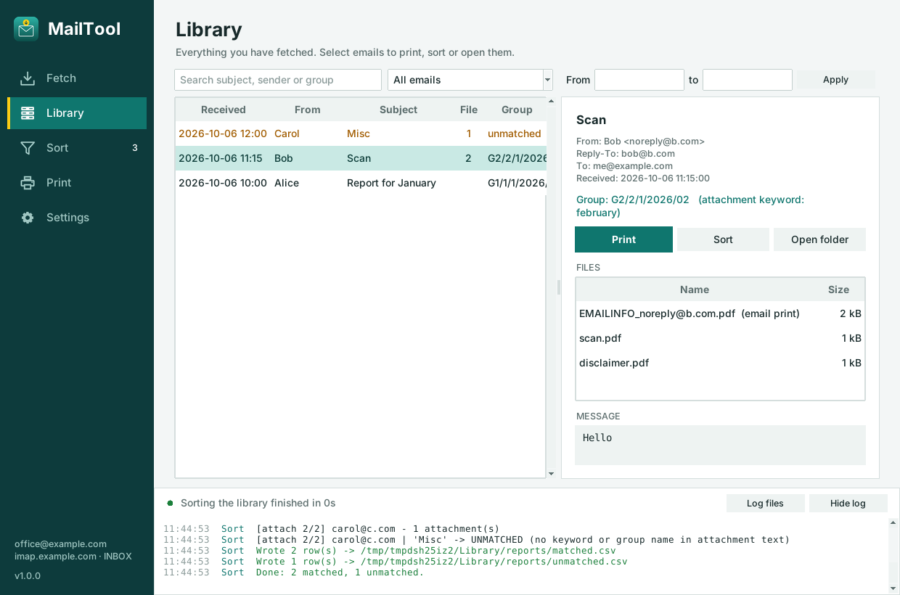

# MailTool

Download, sort and print email in one place. MailTool replaces three separate scripts
(the Email Attachment Fetcher, the Email Grouper and DropPrint) with one app:

| Screen | What it does |
|---|---|
| **Fetch** | Reads a date range of mail over IMAP (read-only, never marks anything as read). Saves attachments into `Library/<date>/<sender> - <subject>/`, can merge an email's PDFs, renders an **EMAILINFO** print of each email, and can export a CSV. |
| **Library** | Everything fetched, searchable, with its group. Select emails and **Print** or **Sort** them. |
| **Sort** | Groups and keywords (same rules as Email Grouper). Sorts the library exactly by UID, or a CSV as a fallback (IMAP or a folder of `.eml` files). Writes `matched.csv` / `unmatched.csv`. |
| **Print** | DropPrint's queue: drop PDFs, Word files, images, whole email folders or WebDAV links; reorder, pick pages and copies; print as one merged job or file by file. |
| **Settings** | Account, library folder, timezone, theme, EMAILINFO layout, printing, and a dependency check with install commands. |



More in `docs/screenshots/` (light and dark themes).

## Run it from source

Needs Python 3.10+ with Tk.

```bash
python -m venv .venv
# Linux:   source .venv/bin/activate        Windows:  .venv\Scripts\activate
pip install -r requirements.txt
python -m playwright install chromium        # only for "Printed"/"Image" email bodies
python run_mailtool.py --check               # what's installed / what to install
python run_mailtool.py                       # the app
```

Linux system packages that help: `python3-tk`, `cups-client` (printing), `ghostscript`
(robust merging), `libreoffice-writer` (Word -> PDF), `antiword` (old .doc text),
`kde-cli-tools kio-extras` or `libglib2.0-bin` (WebDAV drops). `--check` prints the exact
command for your distro. On Windows, printing uses SumatraPDF (`winget install SumatraPDF.SumatraPDF`).

Other command-line options: `--probe` (shows raw drag & drop data from a file manager),
`--install-browser` (downloads the headless Chromium), `--verbose`, and file paths to
pre-load into the print queue.

## Run it in the browser

The same five screens, served to any browser on your network. Tk isn't needed, so this also works on a
headless machine:

```bash
python run_mailtool.py --web                       # all interfaces, port 8765
python run_mailtool.py --web --port 9000           # another port
python run_mailtool.py --web --host 127.0.0.1      # this machine only
MAILTOOL_WEB_TOKEN=my-code python run_mailtool.py --web          # fixed access code
python run_mailtool.py --web --cert cert.pem --key key.pem       # HTTPS
```

`--config PATH` uses another settings file (a folder means `PATH/settings.json`), so the desktop app and
the web server can run side by side with separate settings:

```bash
python run_mailtool.py --web --config ~/.config/MailTool-web/settings.json
python run_mailtool.py                                  # desktop, default settings
```

At start-up it prints the addresses to open and an **access code**. Each browser asks for the code
once, then keeps a session cookie for 30 days. Adding `#code=XXXX-XXXX` to the address logs in
automatically, which is handy as a phone bookmark.

After signing in with the code, MailTool offers a **login file**. It's a small JSON file holding a
per-browser key, and it signs you in later with **Use a login file…** (or by dropping it on the sign-in
box), even after the server restarts with a new code. The server keeps only a hash of each key, in
`web_login_keys.json` next to the settings file. Revoke a file in Settings › General, and browsers
that signed in with it are signed out. Anyone holding the file can sign in, so keep it private.

* **Print:** drag files or whole folders onto the page and they upload to the server's print
  queue (`--max-upload` sets the size limit, default 512 MB). **Download PDF** merges the queue
  into one PDF for the browser to save or print. **Print on server** sends it to a printer on the
  MailTool machine, and only appears when that machine can print.
* **Paths** (library folder, reports folder, `.eml` folder) are folders on the server. A CSV to
  sort is uploaded from the browser.
* **Password:** the IMAP password is typed into the page and sent to the server once. It's kept in
  the server's memory or keyring, never in `settings.json`, and never sent back to a browser.
* **One shared session:** every signed-in browser sees the same queue, jobs and library. Settings
  are the same `settings.json` the desktop app uses unless you pass `--config`.
* **Plain HTTP is unencrypted:** the access code and mail password cross the network in the clear.
  That's fine on a trusted LAN. Anywhere else, use `--cert/--key` or put it behind a reverse proxy
  with HTTPS.

## Where things live

| What | Linux | Windows |
|---|---|---|
| Settings (no passwords) | `~/.config/MailTool/settings.json` | `%APPDATA%\MailTool\settings.json` |
| Logs (one per job + `mailtool.log`) | `~/.local/share/MailTool/logs/` | `%LOCALAPPDATA%\MailTool\logs\` |
| CSV lookup cache | `~/.local/share/MailTool/lookup_cache.sqlite` | `%LOCALAPPDATA%\MailTool\lookup_cache.sqlite` |
| Library | your choice (default `~/Documents/MailTool Library`) | same |
| Library index | `<library>/.mailtool/library.sqlite` | same |
| Sort reports | `<library>/reports/` (or the folder you choose) | same |

The IMAP password is asked for when needed and kept in memory, or saved in the OS
keyring (Windows Credential Manager, KWallet, GNOME Keyring) if you tick *Remember*.
It is never written to the settings file.

## How the pieces connect

```
Fetch ──► Library folder + library.sqlite (one row per email: account, mailbox, UIDVALIDITY, UID,
            │                               Received time, sender, Reply-To, subject, body text,
            │                               attachment list + extracted text)
            ├──► Sort reads the index: subject/body first, then attachment text.
            │      Attachments that were never downloaded are fetched by exact UID.
            └──► Library › Print sends each email's EMAILINFO page, then its attachments,
                   to the Print queue (MERGED_ copies are skipped).
```

Sorting a **CSV** still works: rows with a `UID` column (MailTool's own export) are looked up
exactly; others are found by subject + sender + time in IMAP or an `.eml` folder, and those
lookups are cached.

### Fixes compared to the old scripts

* **CSV time vs header time.** The grouper compared the fetcher's local, timezone-less
  "Date Received" with the sender's `Date:` header by wall clock - e.g. 3 hours apart in
  Nairobi - inside a ±4 s window, so lookups often failed. Times without a zone now count
  as local, and both `Received:` and `Date:` are compared.
* **Reply-To lookups.** The fetcher's CSV `Email` is the Reply-To address when there is one,
  but the grouper searched `FROM` for it. The lookup now tries Reply-To as well - and library
  sorting doesn't search at all.
* Non-ASCII subjects no longer break IMAP searches; `.eml` lookups use the Received time too.
* Certificate checking is on by default; self-signed servers are a per-account opt-in.
* Unnamed inline images are no longer listed as attachments.

## Project layout

```
mailtool/
  core/       config, secrets (keyring), jobs (cancel/progress/log), deps, time, util
  mail/       read-only IMAP session, BODYSTRUCTURE parsing, MIME helpers, .eml folder source
  library/    SQLite index + folder layout
  fetch/      fetch job, EMAILINFO PDF rendering (reportlab / headless Chromium)
  sort/       groups & matching, attachment text extraction, sort jobs
  printing/   staging, conversion, PDF ops, CUPS / SumatraPDF backends
  ui/         Tk screens; theme.py holds the brand colours
  web/        browser version: stdlib HTTP server, JSON API, static/ page (no build step)
  assets/     icons (regenerate with tools/make_assets.py)
tests/        pytest suite (fake mailbox) + gui_smoke.py (needs a display)
MailTool.spec PyInstaller build
```

Nothing in `core/`, `mail/`, `library/`, `fetch/`, `sort/` or `printing/` imports Tk, so the
engines are testable on their own.

## Tests

```bash
pip install -r requirements-dev.txt
python -m pytest                                        # engines, against a fake mailbox
xvfb-run -a python tests/gui_smoke.py /tmp/shots light  # Linux, headless GUI walk-through
python tests/gui_smoke.py shots dark                    # Windows / any desktop session
```

## Building an executable

```bash
pip install -r requirements-dev.txt
pyinstaller --noconfirm MailTool.spec     # -> dist/MailTool[.exe]  (single file)
```

* Windows: put `SumatraPDF.exe` next to `MailTool.spec` to bundle it.
* `MAILTOOL_PLAYWRIGHT=0` leaves Playwright out (about 130 MB smaller); EMAILINFO bodies
  then use the plain-text layout.
* Chromium is not bundled. On each machine use *Settings › Dependencies › Install Chromium*
  (or `MailTool --install-browser`).
* Build on the platform you are targeting - PyInstaller does not cross-compile.
